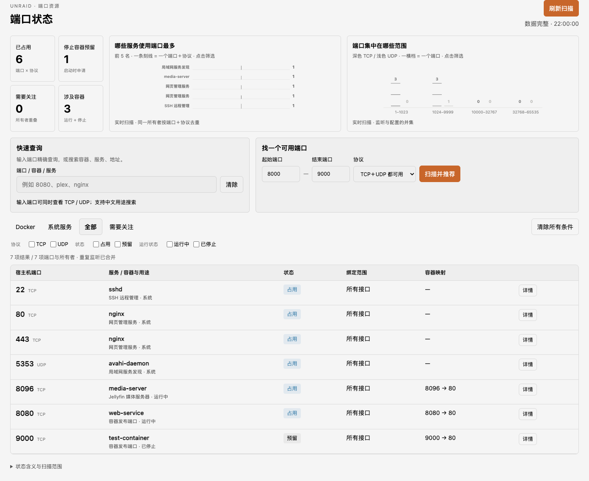
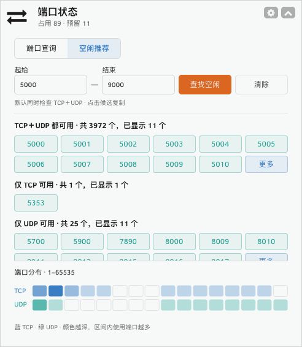

# Port Status · Unraid 端口状态

只读的 Unraid 宿主机端口查询插件，包含首页概览卡片与完整查询页面。

- 查询 TCP / UDP 监听、进程、绑定地址和 Docker 端口映射。
- 区分正在占用的端口与停止容器的端口预留，提示绑定重叠及启动冲突风险。
- 按端口、容器、服务搜索，支持来源、协议和状态筛选。
- 按范围推荐 TCP、UDP 或双方均可用的端口，分批展示并支持复制。
- 首页每 120 秒刷新；页面隐藏时暂停自动扫描。

插件不修改容器、网络、防火墙或系统服务配置，不运行后台服务。

## 界面预览

### 完整查询页

查看端口占用、停止容器预留、服务用途与绑定详情，按来源、协议和状态筛选。



*使用当前源码与示例数据展示，非实时 NAS 扫描结果。*

### 首页卡片

折叠时显示占用、预留摘要及 TCP / UDP 分布：


展开后可直接查询端口，或按范围推荐并复制空闲候选：



*首页卡片图片来自此前的 Unraid 实测；数值为截图时刻的状态。*

## 安装

要求 Unraid 6.12+ / 7.x、PHP 7.4+，以及系统提供的 `ss`、`docker`、`timeout`。实际版本兼容性需在目标机器验收。

在 Unraid **Plugins → Install Plugin** 中输入：

```text
https://raw.githubusercontent.com/mizhimu/unraid-port-manager/main/port-manager.plg
```

或从 [Releases](https://github.com/mizhimu/unraid-port-manager/releases) 下载 `port-manager.plg`，复制到 NAS 并运行：

```sh
plugin install /boot/config/plugins/port-manager.plg
```

安装后刷新 WebGUI，打开 **Tools → 端口状态**，或查看首页卡片。
安装包自包含，无须下载额外运行依赖。插件列表的 **Support Thread / 支持论坛** 链接指向本项目。

## 更新与卸载

安装 1.0.4 后，可在 **Plugins → Check for Updates** 检查新版，出现 **Update / 更新** 后点击即可安装。插件通过标准 `pluginURL` 读取本仓库 `main` 分支的 PLG；不会自行后台安装。也可从 Releases 下载新版本手动安装。

已安装的旧版没有更新地址，需要先手动安装一次 1.0.4，之后才能使用一键更新。
如果安装器拒绝同版本或旧开发版本迁移，可使用：

```sh
plugin install /tmp/port-manager.plg forced
```

在 Plugins 页面卸载。卸载只删除本插件安装目录和启动盘上的插件数据，不修改容器及网络配置。

## 扫描范围与限制

- 占用：系统实际监听或运行容器发布的宿主机端口，包括 NAT 发布。
- 预留：停止容器配置的宿主机映射。macvlan/ipvlan 未实际发布的端口配置不计入宿主机预留。
- host 网络容器通过实际进程 PID 关联监听，不把 EXPOSE 当作宿主机端口。
- 不包含 VM 和独立 IP 容器内部端口，也不读取尚未创建容器的 XML 模板。
- 推荐排除 1–1023、系统动态端口范围，以及同协议任何绑定地址上的占用和预留。采集不完整时禁止推荐。
- 风险提示不等同于实际启动失败。共享监听及 IPv4/IPv6 双栈行为需结合部署情况确认。
- 数据顺序采样，结果只代表扫描时刻；部署前请刷新。大型 host 容器集合可能采集较慢。

API 依赖 Unraid WebGUI 的访问认证。请勿将源代码直接部署到公开 Web 服务器。

## 开发

```sh
php tests/scanner.php
php -l src/port-manager/include/Scanner.php
php -l src/port-manager/include/api.php
node --check src/port-manager/assets/app.js
node --check src/port-manager/assets/dashboard.js
node --check src/port-manager/assets/charts.js
python3 scripts/build.py
python3 tests/package.py
```

`scripts/build.py` 统一维护版本和作者，生成根目录的 `port-manager.plg` 及 `dist/` 安装产物。`dist/` 不纳入 Git。
GitHub Actions 执行核心测试、语法和安装包校验。真实 Unraid 验收步骤见 [TESTING.md](TESTING.md)。

## 支持与许可

问题和功能建议请提交 [GitHub Issues](https://github.com/mizhimu/unraid-port-manager/issues)，附上 Unraid 版本、复现步骤和错误信息。请去除 IP、容器名称等不希望公开的信息。

图表改编自 Lieflat Charts，采用 PolyForm Noncommercial 1.0.0。项目按同一非商业许可发布，详见 [LICENSE](LICENSE) 和 [THIRD_PARTY_NOTICES.md](THIRD_PARTY_NOTICES.md)。

维护者发布步骤见 [RELEASING.md](RELEASING.md)。

作者：mizhimu。版本记录见 [CHANGELOG.md](CHANGELOG.md)。
